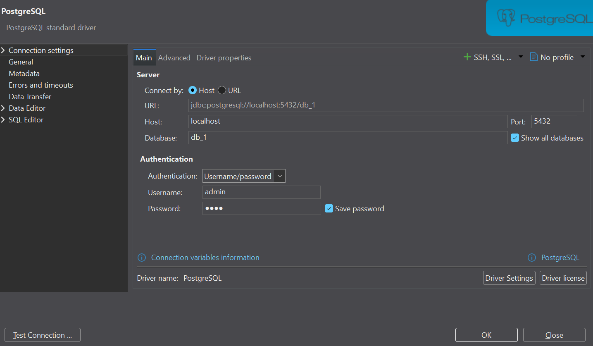

# Docker: PostgreSQL, FastAPI, Jupyter Notebook and Python
A sample project that runs four services using Docker Compose and allows them to communicate within a shared Docker network.

## ✨ Services
- **PostgreSQL 17 (`postgres`)**: Persistent database. It uses the environment variables defined in `.env` and executes `postgres/init.sql` when initializing a new database.
- **FastAPI (`web_api`)**: API built from `./fastapi`, available at `http://localhost:8000`.
- **Jupyter Notebook (`jupyter`)**: Interactive environment available at `http://localhost:8888`, with files from `./jupyter` mounted at `/home/jovyan/work`.
- **Python (`python`)**: Application built from `./python`. The service is set to `restart: "no"`, so it does not automatically restart upon completion.

The four services connect to the `app_network` network. The Python, FastAPI, and Jupyter services wait for PostgreSQL to pass its health check (`service_healthy`) before starting.

> **Important:** The current Jupyter configuration disables the token and password. This is an insecure configuration for shared machines or networks; use it only in a trusted local environment and enable authentication if you expose the service to others.

## 🌎 Structure
```text
Docker/
├── fastapi/
│   └── Dockerfile
│   ├── requirements.txt
│   └── main.py
├── jupyter/
│   ├── Dockerfile
│   └── notebook.ipynb
├── postgres/
│   └── init.sql
├── python/
│   ├── Dockerfile
│   ├── requirements.txt
│   └── app.py
├── .env            (not provided)
└── compose.yml
```

## ⚙️ Configuración
1. Clone this repository:
```bash
git clone https://github.com/arteaga7/Docker.git
cd Docker
```

2. Create your `.env` file in the same folder than `compose.yml`, with the following content:
```dotenv
POSTGRES_DB=db_1
POSTGRES_USER=admin
POSTGRES_PASSWORD=Your_Password
POSTGRES_HOST=postgres
POSTGRES_PORT=5432
```

`POSTGRES_HOST=postgres` is the name of the PostgreSQL service within the Docker network. From other containers, use `postgres:5432`; from the host machine, use `localhost:5432`.

## 🚀 Installation
1. Clone and create .env file, as explained in 'Configuration' section.

2. Start everything (Postgres + FastAPI + Jupyter + Python) with the following command (first time only):
```bash
docker compose up --build
```

The command builds the images that require it and starts the services. PostgreSQL must pass the health check first; then, Docker Compose allows the services that depend on it to start.

To build and run the containers in the background:
```bash
docker compose up --build -d
```

To run the containers in the background, if they were built before:
```bash
docker compose up -d
```

If Docker is not running, use the following command (linux):
```bash
sudo systemctl start docker
```

3. To access to the services:

| Service | Directions from the host |
|---|---|
| FastAPI interactive documentation (Swagger UI) | http://localhost:8000/docs |
| API: list all users | http://localhost:8000/usuarios |
| API: query user by ID | http://localhost:8000/usuarios/1 |
| Jupyter Notebook | http://localhost:8888 |

4. Close everything with:
```bash
docker compose down
```
PostgreSQL data is preserved in the `postgres_data` volume.

⚠️ **Warning**. To delete a volume (all data will be removed):
```bash
docker compose down -v
```

## 💻 Consult the logs
To follow the logs:
```bash
docker compose logs
```

To follow the logs of a specific service:
```bash
docker compose logs -f postgres
docker compose logs -f web_api
docker compose logs -f python
docker compose logs -f jupyter
```

The `python` container may exit after completing its task; this is compatible with `restart: "no"`.

## 🗄️ PostgreSQL persistence and initialization

- The `postgres_data` volume persists PostgreSQL data across container restarts and recreations.
- The `./postgres/init.sql` file is mounted to `/docker-entrypoint-initdb.d/init.sql`.
- The official PostgreSQL image's initialization scripts run when an empty data directory is initialized. If the volume already contains a database, modifying `init.sql` and running Compose again will not automatically trigger the script to run again.
- To start from scratch, you can remove the volume using `docker compose down -v`; note that you will lose the stored data.

## 🔗 Communication between containers
The services share the `app_network` network. To connect an application inside a container to PostgreSQL, use the service name `postgres` as the host and port `5432`. Do not use `localhost` as the PostgreSQL host from another container, because `localhost` refers to the container itself.

## 🔎 Inspect the database
To connect to the database, 

